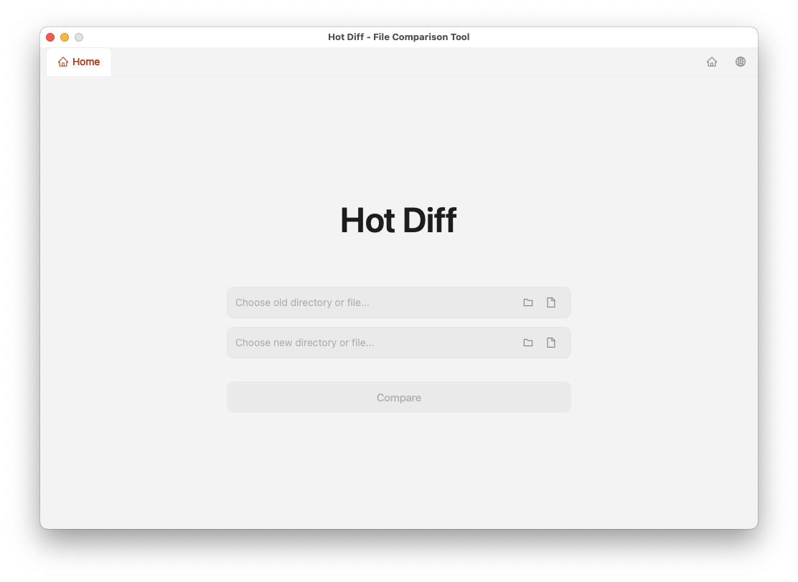

# Hot Diff

A cross-platform file and directory comparison tool built with
[Wails](https://wails.io), React, and Monaco Editor.

## Screenshots



## Features

- **Directory Comparison** — compare two directories side by side and get a
  summary of identical, different, similar, and unique files
- **File Diff Viewer** — view side-by-side diffs with syntax highlighting
  powered by Monaco Editor
- **Image Comparison** — compare image files (PNG, JPEG, GIF, BMP, WebP, SVG,
  TIFF, ICO, HEIC, AVIF, and more) with side-by-side visual diff
- **CSV Diff** — compare CSV files side by side as text diff
- **Modern UI** — clean design with Ant Design components and dark theme support
- **i18n Support** — English and Chinese with a language switcher
- **Tabbed Interface** — compare multiple file pairs simultaneously in
  separate tabs

## Download

Download the latest release from the
[GitHub Releases](https://github.com/hotdiff/hotdiff/releases) page.

Available for:

- **macOS** — `.dmg` (Apple Silicon / Intel)
- **Windows** — `.exe` installer

## Tech Stack

| Layer     | Technology                          |
|-----------|-------------------------------------|
| Framework | [Wails v2](https://wails.io)        |
| Frontend  | React 18 + TypeScript + Vite        |
| UI        | Ant Design 5                        |
| Diff      | Monaco Editor                       |
| i18n      | i18next + react-i18next             |
| Backend   | Go                                  |

## Prerequisites

- Go 1.23+
- Node.js 20+
- [Wails CLI](https://wails.io/docs/gettingstarted/installation)

## Getting Started

### Live Development

```bash
wails dev
```

This starts a Vite dev server with hot reload for frontend changes and a Wails
dev server for Go backend calls.

### Build

```bash
wails build
```

Produces a native application bundle in the `build/bin/` directory.

## Usage

1. Launch the app — the home screen shows two input fields
2. Click the folder or file icons on the right side of each input to select
   a left and right path
3. Press **Compare** to start the comparison
4. Browse results in a tree view with status indicators:

   - `=` Same — identical files
   - `≠` Different — files differ
   - `≈` Similar — files have minor differences
   - `L` Left Only — exists only on the left
   - `R` Right Only — exists only on the right

5. Click any file to open the diff viewer in a new tab
6. Use the globe icon in the tab bar to switch between English and Chinese

## Project Structure

```text
hotdiff/
├── app.go              # Application backend (file dialogs, comparison API)
├── main.go             # Entry point + window configuration
├── diff/               # Diff engine (Go)
│   ├── diff.go         # Directory/file comparison
│   ├── language.go     # File extension → Monaco language mapping
│   └── types.go        # Shared types
├── frontend/           # React frontend
│   └── src/
│       ├── App.tsx     # Root component with tab management
│       ├── components/
│       │   ├── HomeView.tsx    # Path selection screen
│       │   ├── ResultView.tsx  # Comparison results list
│       │   └── DiffView.tsx    # Monaco diff / image viewer
│       ├── i18n/       # Translation files (en.json, zh.json)
│       └── models/     # TypeScript type definitions
├── screenshots/        # App screenshots
└── wails.json          # Wails project configuration
```

## Community

- **Issues & Feature Requests**:
  [GitHub Issues](https://github.com/hotdiff/hotdiff/issues)
- **Discussions**:
  [GitHub Discussions](https://github.com/hotdiff/hotdiff/discussions)

## Contributing

Contributions are welcome! Here's how you can help:

1. Fork the repository
2. Create a feature branch (`git checkout -b feature/amazing-feature`)
3. Make your changes
4. Run `wails dev` to verify everything works
5. Commit and push (`git commit -m "feat: add amazing feature"`)
6. Open a Pull Request

Please ensure your code follows the existing style conventions and passes
TypeScript type checks before submitting.

## License

MIT License — see [LICENSE](LICENSE) for details.
